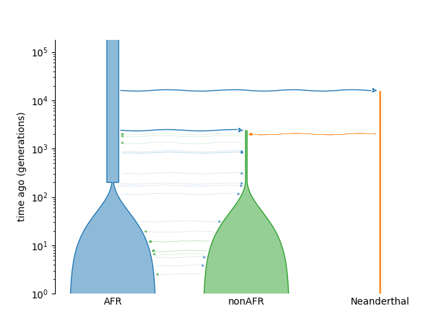

# 02.Simulation analysis

## Overview

This directory contains the complete pipeline for simulating human-archaic admixture and evaluating the accuracy of various introgression detection tools. The pipeline starts with `msprime` simulation to generate simulated genomes and ground-truth tracts, followed by tool-specific execution and final performance benchmarking. Additional analyses evaluate the robustness of ASMaid to different definitions of introgressed tracts and assess the contribution of copy-number/read-depth information.

## Simulation Demography

<div align=center>

</div>

## Code Structure

* `01.simulate_by_msprime.py`: Simulates a demographic model (African, non-African and Neanderthal with archaic introgression) and generates raw VCFs for ASMaid input (e.g.`Sim_Result/nonAFR_1.vcf`) and truth labels (e.g. `Sim_Result/nonAFR_1.intro`).
* `01.extract_introgression_ground_truth.py`: Extracts introgressed tracts from the simulated tree sequence using recorded migration events (`record_migrations=True`) and generates migration-based ground-truth labels.
* `01.inject_continuous_cnv.py`: Introduces simulated copy-number/read-depth variation into selected introgressed and non-introgressed regions to evaluate the contribution of the CN module to ASMaid performance.
* `02.call_ASMaid_for_simulation.sh`: Runs the ASMaid HMM with various parameters (e.g., number of Africans used for background control).
* `02.evaluate_ASMaid_for_simulation.sh`: Preliminary evaluation for ASMaid results across different parameters and filters.
* `03.convert_haploid_vcf.to.diploid.py`: Converts simulated haploid VCFs to diploid format to satisfy the input requirements of IBDmix and Sprime.
* `04.call_IBDmix_for_simulation.sh`: Pipeline for running IBDmix (genotype generation, LOD scoring, and filtering).
* `04.call_Sprime_for_simulation.*`: Scripts for running Sprime, including genetic map construction and archaic allele matching.
* `05.evaluate.ASMaid_IBDmix_Sprime.py`: Final comprehensive evaluation script that compares all tools.

## Detailed Usage

### Step1: Population Genetic Simulation

Generate simulated sequencing data based on an Out-of-Africa model.

```python
python 01.simulate_by_msprime.py
# output example: Sim_Result/nonAFR_1.vcf & Sim_Result/nonAFR_1.intro
```

* Input: Defined parameters in the script (Mutation rate: 1.25e-8, Recombination rate: 1e-8).
* Output: `Sim_Result/sample/` will contain simulated VCFs and truth label files based on tree coalescence.

#### Step 1.1: Introgression Ground-truth Definition

To reduce potential bias caused by defining introgressed tracts solely based on coalescence with the sampled archaic genome, migration events are recorded during simulation using `record_migrations=True`.

```python
python 01.extract_introgression_ground_truth.py
# output: xxx.old.intro for coalescing-based ground truth, xxx.new.intro for migrating-based ground truth
```
<div align=center>

</div>

The migration-based ground truth identifies genomic intervals that experienced migration during the predefined introgression epoch. This definition does not require an introgressed lineage to coalesce with the sampled archaic genome and therefore also captures introgressed lineages that coalesced before the divergence of the sampled archaic population.

The resulting `.intro` files are used as ground-truth labels for ASMaid evaluation.


#### Step 1.2: Contribution of Copy-number/Read-depth Information

To evaluate the contribution of copy-number/read-depth information to ASMaid performance, simulated copy-number and read-depth variation can be introduced into the simulated genomes:

```python
python 01.inject_continuous_cnv.py
```

<div align=center>

</div>

The script introduces continuous copy-number/read-depth variation into selected introgressed and non-introgressed regions. ASMaid performance is then compared between genotype-only information and the combination of genotype and copy-number/read-depth information using the same ground-truth tracts.
The simulation includes two types of CNV signals:
1. **Introgression-associated CNVs**, introduced into approximately 40% of genotype-supported introgressed tracts.
2. **Background CNVs**, introduced into non-introgressed regions to represent standing copy-number polymorphisms and potential confounding signals.
The injected structural variants include deletions and duplications ranging from 1 to 40 kb. Read-depth variation is simulated using Gaussian distributions N(μ, σ) with different variances assigned to archaic and modern human samples to reflect differences in sequencing noise.

### Step2: Running Introgression Detection Tools

#### 2.1 ASMaid

ASMaid works directly on the simulated haploid VCFs. To optimize ASMaid for archaic introgression detection, we systematically evaluated its key parameters and filtration criteria using simulated datasets.

```bash
# Run ASMaid with different paramters and filters
bash 02.call_ASMaid_for_simulation.sh

# Evaluate the performance of ASMaid
bash 02.evaluate_ASMaid_for_simulation.sh
```

* First, we assessed the impact of the `East African size` (number of AFR = 5, 10, 15, 20) as a background control. While larger panels marginally improved accuracy, we selected n (AFR) = 10 for all downstream analyses to achieve an optimal balance between high F1-scores and computational efficiency.
* Second, we evaluated the `non-supportive genotype frequency threshold` —the maximum allowable frequency of the reference allele within the African panel for a site to be considered archaic-supportive. Simulations indicated that maximum stringency yielded the highest specificity; thus, we set this threshold to 0, requiring a complete absence of the reference allele in the African background.
* Finally, we refined the post-decoding filters by prioritizing a `posterior probability` of > 0.9 to ensure high-confidence segment calls. `Segment length filters` were adaptively determined based on the specific genomic context and assembly resolution, ensuring robust performance across heterogeneous genomic environments.

#### 2.2 IBDmix & Sprime (Comparison)

These tools require diploid VCFs. First, convert the simulation output:

```bash
python 03.convert_haploid_vcf.to.diploid.py
# output example: Sim_Result/note.sim.total.diploid.vcf
```

Then, execute the respective calling scripts:

```bash
# For IBDmix:
bash 04.call_IBDmix_for_simulation.sh

# For Sprime: (Map generation -> Sprime run -> Match info)
bash 04.call_Sprime_for_simulation.01_run_software.sh
```

### Step 3: Comparative Evaluation

Calculate the overlap between the detected tracts and the ground truth.

```bash
python 05.evaluate.ASMaid_IBDmix_Sprime.py
```

The script outputs a summary table containing:

* Precision: $TP / (TP + FP)$
* Recall: $TP / (TP + FN)$
* F1-score: Harmonic mean of Precision and Recall.
* FPR: False Positive Rate per 100 Mbp (Since the total length of the simulated data per sample is 100 Mbp).


## Tool Confiurations

| Tool   | Filtering Criteria                               |
| ------ | ------------------------------------------------ |
| ASMaid | Posterior Probability > 0.9                      |
| IBDmix | Length > 50kb and LOD score > 4                  |
| Sprime | Score > 150,000 and matched with archaic alleles |
